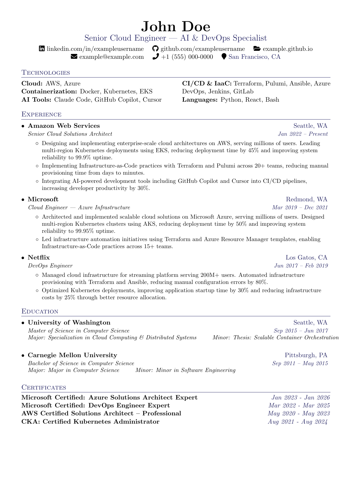
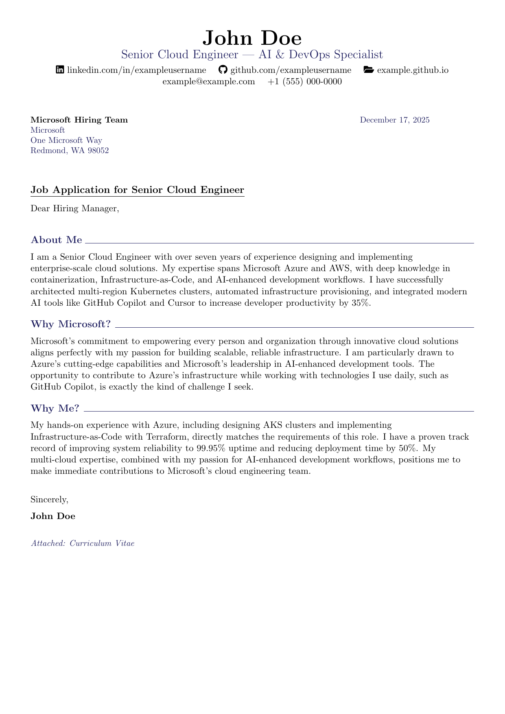

# Professional CV / Resume and Cover Letter LaTeX Templates

[](https://github.com/iggymiggy/latex-cv-cover-letter/actions/workflows/ci.yml)
[](templates/common.sty)

A clean, modern LaTeX template for a professional **CV** (also called a **resume/résumé**) and cover letter. ATS-friendly and easy to customize.

**Keywords**: CV, resume, résumé, curriculum vitae, cover letter

## Features

- **One-page CV layout** - All CVs are designed to fit on a single page
- Matching cover letter template
- **Company-specific customization** - Tailor CV and cover letter for each application
- **Shared code architecture** - Common packages and commands in `templates/common.sty`
- **Shared company variables** - Variables used by both CV and cover letter in `shared.tex`
- Centralized personal information
- Optional sections: Certificates, Open Source, Volunteer Work, Languages, Awards
- Optional certificate links (Credly badges)
- Multi-language date formatting (configurable via babel)
- Paper size is configurable (A4 by default)

## Examples

Each company folder generates customized PDFs with company-specific CV skills and cover letter content/styles.

### Google

<table>
  <tr>
    <td width="50%" valign="top">
      <p align="center">
        <strong>CV</strong><br>
        <a href="examples/companies/google_cv.pdf">
          
        </a><br>
        <a href="examples/companies/google_cv.pdf">View PDF</a>
      </p>
    </td>
    <td width="50%" valign="top">
      <p align="center">
        <strong>Cover Letter</strong><br>
        <a href="examples/companies/google_cover_letter.pdf">
          
        </a><br>
        <a href="examples/companies/google_cover_letter.pdf">View PDF</a>
      </p>
    </td>
  </tr>
</table>

### Hyperion BioSystems

<table>
  <tr>
    <td width="50%" valign="top">
      <p align="center">
        <strong>CV</strong><br>
        <a href="examples/companies/hyperion_cv.pdf">
          
        </a><br>
        <a href="examples/companies/hyperion_cv.pdf">View PDF</a>
      </p>
    </td>
    <td width="50%" valign="top">
      <p align="center">
        <strong>Cover Letter</strong><br>
        <a href="examples/companies/hyperion_cover_letter.pdf">
          
        </a><br>
        <a href="examples/companies/hyperion_cover_letter.pdf">View PDF</a>
      </p>
    </td>
  </tr>
</table>

### Meta

<table>
  <tr>
    <td width="50%" valign="top">
      <p align="center">
        <strong>CV</strong><br>
        <a href="examples/companies/meta_cv.pdf">
          
        </a><br>
        <a href="examples/companies/meta_cv.pdf">View PDF</a>
      </p>
    </td>
    <td width="50%" valign="top">
      <p align="center">
        <strong>Cover Letter</strong><br>
        <a href="examples/companies/meta_cover_letter.pdf">
          
        </a><br>
        <a href="examples/companies/meta_cover_letter.pdf">View PDF</a>
      </p>
    </td>
  </tr>
</table>

### NASA

<table>
  <tr>
    <td width="50%" valign="top">
      <p align="center">
        <strong>CV</strong><br>
        <a href="examples/companies/nasa_cv.pdf">
          
        </a><br>
        <a href="examples/companies/nasa_cv.pdf">View PDF</a>
      </p>
    </td>
    <td width="50%" valign="top">
      <p align="center">
        <strong>Cover Letter</strong><br>
        <a href="examples/companies/nasa_cover_letter.pdf">
          
        </a><br>
        <a href="examples/companies/nasa_cover_letter.pdf">View PDF</a>
      </p>
    </td>
  </tr>
</table>

### Microsoft

<table>
  <tr>
    <td width="50%" valign="top">
      <p align="center">
        <strong>CV</strong><br>
        <a href="examples/companies/microsoft_cv.pdf">
          
        </a><br>
        <a href="examples/companies/microsoft_cv.pdf">View PDF</a>
      </p>
    </td>
    <td width="50%" valign="top">
      <p align="center">
        <strong>Cover Letter</strong><br>
        <a href="examples/companies/microsoft_cover_letter.pdf">
          
        </a><br>
        <a href="examples/companies/microsoft_cover_letter.pdf">View PDF</a>
      </p>
    </td>
  </tr>
</table>

## Quick Start

### 1. Set Up Personal Information

**First time setup:**
```bash
# Copy the example template to create your personal info file
cp personal_info.example.tex personal_info.tex
```

**Then edit `personal_info.tex`** with your name, contact info, and online presence:
- Replace `John Doe` with your name
- Replace `example@example.com` with your email
- Replace `+1 (555) 000-0000` with your phone number
- Replace `exampleusername` with your LinkedIn/GitHub usernames
- Replace `example.github.io` with your portfolio URL

**Note:** `personal_info.tex` is ignored by Git (see `.gitignore`) to keep your personal data private. The `personal_info.example.tex` file serves as a template and is tracked in the repository.

### 2. Build Your CV and Cover Letter

**Option A: Using Docker (recommended for easy setup)**
```bash
# No need to install TeX Live locally!
# Build all companies
docker-compose run latex make all

# Build specific company
docker-compose run latex make <company>

# Validate templates
docker-compose run latex make validate

# Interactive shell (for debugging)
docker-compose run latex bash
```

**Option B: Using Makefile (requires local TeX Live installation)**
```bash
# Build all companies (auto-detected from companies/ directory)
make

# Build specific company
make <company>  # Any company directory in companies/

# Build base templates
make templates
```

**Manual compilation:**
```bash
cd companies/google  # or any company directory
pdflatex cv.tex
pdflatex cover_letter.tex
# Or use -jobname for company-prefixed output:
pdflatex -jobname="google_cv" cv.tex
```

**Create a new company:**
```bash
cp -R companies/nasa companies/your_company
# Edit companies/your_company/shared.tex, cv.tex, and cover_letter.tex
make your_company  # Auto-detected, no Makefile update needed
```

## Project Structure

```
project/
├── personal_info.example.tex  # Template for personal info (tracked in Git)
├── personal_info.tex          # Your personal info (ignored by Git, create from example)
├── document_settings.tex      # Global settings (paper size, font size)
├── templates/                 # Base templates and shared code
│   ├── cv_template.tex       # Base CV template
│   ├── cover_letter_template.tex # Base cover letter template
│   ├── base_config.tex       # Default values for all fields
│   └── common.sty            # Shared packages, commands, and helper macros
└── companies/                 # Company-specific folders
    ├── google/
    │   ├── shared.tex        # Shared variables (cvtitle, etc.)
    │   ├── cv.tex            # CV customizations
    │   └── cover_letter.tex  # Cover letter customizations
    ├── hyperion/
    │   ├── shared.tex
    │   ├── cv.tex
    │   └── cover_letter.tex
    ├── meta/
    │   └── ...
    └── nasa/
        └── ...
```

## Configuration

### Base Configuration (`templates/base_config.tex`)

Contains default values for all fields:
- CV: title, technologies, certificates (4), open source (empty), volunteer (empty), languages (empty), awards (empty)
- Cover letter: company details, letter content, date settings

### Company Files

Each company folder contains three files:

**1. `shared.tex` - Shared variables (used by both CV and cover letter)**
```latex
% Professional title (used in headers of both CV and cover letter)
\renewcommand{\cvtitle}{Space Systems Engineer | Flight Software Specialist}
```

**2. `cv.tex` - CV-specific customizations**
```latex
% Load shared company configuration (variables used by both CV and cover letter)
\loadfile{shared.tex}{}

% CV customizations
\renewcommand{\cvtechnologies}{%
  \section{Technologies}
  \noindent
  \textbf{Category:} Skills, tools, technologies...
}

% Certificates with optional links
\renewcommand{\cvcertificates}{%
  \href{https://www.credly.com/badges/YOUR_BADGE_ID}{\textbf{Certificate Name}} & \textcolor{gray}{\textit{Date}} \\
  \textbf{Certificate Without Link} & \textcolor{gray}{\textit{Date}} \\
}

% Optional sections (leave empty to hide)
\renewcommand{\cvopensource}{...}      % Open Source Contributions
\renewcommand{\cvvolunteer}{...}       % Volunteer Work
\renewcommand{\cvlanguages}{...}      % Languages
\renewcommand{\cvawards}{...}         % Awards & Honors
```

**3. `cover_letter.tex` - Cover letter-specific customizations**
```latex
% Load shared company configuration (variables used by both CV and cover letter)
\loadfile{shared.tex}{}

% Company details
\renewcommand{\companyname}{Company Name}
\renewcommand{\companyaddress}{Company Address}
\renewcommand{\companyrecipient}{Hiring Manager}
\renewcommand{\companycity}{City, State ZIP}

% Letter settings
\renewcommand{\letterdatelanguage}{english}  % or "finnish" (must match babel languages)
\renewcommand{\letterdate}{auto}             % or specific date like "January 15, 2024"
\renewcommand{\lettertitle}{Application for Position Title}
\renewcommand{\letteropening}{Dear Hiring Manager,}
\renewcommand{\letterclosing}{Sincerely,}

% Letter body
\renewcommand{\letterbody}{%
  Your letter content here...
}
```

**4. PDF Metadata Customization (Optional)**
```latex
% In companies/*/cv.tex or cover_letter.tex, customize PDF metadata:
% You can use either \newcommand or \renewcommand (both work)
\renewcommand{\pdfmetatitle}{Your Name - Your Title CV}  % PDF title
\renewcommand{\pdfmetaauthor}{Your Name}  % PDF author (default: \myname)
\renewcommand{\pdfmetasubject}{Your Title CV for Company}  % PDF subject
\renewcommand{\pdfmetakeywords}{Your, Keywords, Here, CV}  % PDF keywords

% If not set, defaults are auto-generated from your personal info:
% - Title: "\myname - \cvtitle"
% - Author: "\myname" (your name from personal_info.tex)
% - Subject: "CV Template vX.Y.Z (YYYY-MM-DD)"
% - Keywords: "CV, Resume, LaTeX, Template vX.Y.Z"
```

**Key points:**
- Use `\renewcommand` (not `\newcommand`) to override base defaults
- `shared.tex` contains variables used by both CV and cover letter (like `\cvtitle`)
- Only define fields that differ from base - undefined fields use base defaults
- Optional sections are hidden if empty
- Date language must match a language loaded in babel (e.g., `[finnish,english]`)

## CV Sections

**Required:**
- Header (name, title, contact)
- Experience
- Education

**Optional (configurable in `cv.tex`):**
- Technologies/Skills (set `\renewcommand{\cvtechnologies}{}` to hide)
- Certificates (with optional clickable links)
- Open Source Contributions
- Volunteer Work
- Languages
- Awards & Honors

### Section Ordering

You can customize the order of CV sections per company using `\cvsectionorder`. This allows you to prioritize different sections for different applications.

**Default order:**
```latex
technologies,experience,education,certificates,opensource,volunteer,languages,awards
```

**To reorder sections**, override `\cvsectionorder` in your company's `cv.tex` file:

```latex
% Example: Put experience first, then education, then technologies
\renewcommand{\cvsectionorder}{experience,education,technologies,certificates}

% Example: Hide some sections and reorder
\renewcommand{\cvsectionorder}{experience,education,certificates,awards}

% Example: Put technologies at the end
\renewcommand{\cvsectionorder}{experience,education,certificates,technologies}
```

**Available section names:**
- `technologies` - Technologies/Skills section
- `experience` - Work experience
- `education` - Education
- `certificates` - Certifications
- `opensource` - Open Source Contributions
- `volunteer` - Volunteer Work
- `languages` - Languages
- `awards` - Awards & Honors

**Notes:**
- Sections not listed in `\cvsectionorder` are skipped (hidden)
- Sections are rendered in the exact order specified
- Empty optional sections are automatically hidden (even if in the order list)
- Experience and Education are always available (but can be excluded from the order list to hide them)

## Cover Letter Sections

- Header (same as CV)
- Company details and date
- Letter title and opening
- Letter body (**company-specific**)
- Closing

**Cover letter body styles (examples in this repo):**
- **Headed sections + horizontal rule**: Google
- **Headed sections (no horizontal rule)**: Meta
- **Plain paragraphs (no section headlines)**: Hyperion
- **Impact bullets (paragraph + 2–3 bullets + paragraphs)**: NASA

**How to customize the body:**
- **Content and layout**: override `\letterbody` directly in `companies/*/cover_letter.tex` - define your letter content inline (no intermediate variables needed)
- **Optional style helpers**: override `\lettersection` in `companies/*/cover_letter.tex` if you want to customize section heading appearance

## Requirements

**Option 1: Docker (recommended - no local installation needed)**
- Docker and Docker Compose
- All LaTeX dependencies are included in the container

**Option 2: Local LaTeX installation**
- LaTeX distribution (TeX Live, MiKTeX, or MacTeX)
- Packages: `xcolor`, `hyperref`, `bookmark`, `fontawesome5`, `babel`, `tabularx`, `titlesec`, `fancyhdr`, `enumitem`, `etoolbox`
- Make (optional, for automated builds)
- chktex (optional, for advanced linting - install via `brew install chktex` on macOS or `sudo apt-get install chktex` on Linux)

Most packages are included in standard LaTeX distributions.

## Building

You have two main ways to build:

- **Makefile**: See **Quick Start → 2. Build Your CV and Cover Letter** for concrete commands (`make`, `make <company>`, `make templates`, etc.).
- **Manual LaTeX**: `cd companies/<company> && pdflatex cv.tex && pdflatex cover_letter.tex` (run twice for cross‑references).

**Output:** Makefile generates `{company}_cv.pdf` and `{company}_cover_letter.pdf`. Companies are auto‑detected from `companies/` directory.

**Performance:** `make` builds all companies in parallel by default (uses all CPU cores). Use `make all-sequential` for sequential builds (useful for debugging).

### Docker Usage (Optional)

The project includes Docker support for easy setup without installing TeX Live locally.

**Benefits:**
- ✅ No need to install TeX Live (~4–5 GB download)
- ✅ Consistent environment across macOS, Linux, and Windows
- ✅ Same environment as CI (reproducible builds)
- ✅ Clean system (no system‑wide LaTeX installation)
- ✅ Easy version control (pin specific LaTeX version)

See **Quick Start → 2. Build Your CV and Cover Letter (Option A: Docker)** for example commands.

**First time setup:**
```bash
# Build the Docker image (one-time, ~2–3 GB download)
docker-compose build

# Or pull pre-built image
docker pull texlive/texlive:latest
```

**Files:**
- `Dockerfile` - LaTeX environment with all dependencies
- `docker-compose.yml` - Easy container management
- `.dockerignore` - Excludes build artifacts from Docker context

**Note:** Docker is optional. You can still use local TeX Live installation if preferred.

## Example Generation

The project includes an automated script to generate example files for the README:

```bash
# Generate example PDFs and PNGs from built companies
make examples

# Or build all companies and generate examples in one command
make all-examples
make all-examples-parallel  # Faster: parallel build + examples
```

**What it does:**
- Copies PDFs from `companies/*/` to `examples/companies/`
- Regenerates PNG images using `pdftoppm` (150 DPI)
- Ensures examples stay in sync with template changes
- Validates that source PDFs exist before copying

**Requirements:** `pdftoppm` (install via `brew install poppler` on macOS or `sudo apt-get install poppler-utils` on Linux)

## Validation and Linting

**Validation** (`make validate`): Compiles all templates and company files to check for errors.

**Linting** (`make lint`): Checks for mismatched braces, undefined commands, typos, and hardcoded paths.

Both are also available via pre-commit hooks (see below) and **GitHub Actions CI** (see below).

### Continuous Integration (CI)

The project includes GitHub Actions workflows that automatically:

- ✅ Validate all templates compile on every commit/PR
- ✅ Run linting checks
- ✅ Build all company CVs and cover letters
- ✅ Generate example PDFs and PNGs
- ✅ Test base templates

**Workflow file:** `.github/workflows/ci.yml`

**CI Environment:** Uses Docker for consistent builds (same environment as local development). Docker image is cached for faster subsequent runs.

The CI runs on:
- Every push to `main` and `develop` branches
- Every pull request to `main` and `develop` branches

**Status badges** are available in the README header (update the repository path after pushing to GitHub).

### Pre-commit Hooks

A Git pre-commit hook is included to automatically validate and lint your LaTeX files before committing:

**What it does:**
- Runs `make lint` to check for LaTeX errors
- Runs `make validate` to ensure all templates compile
- Blocks commits if errors are found
- Provides clear error messages

**Installation:**
```bash
# Copy the hook template to Git hooks directory
cp scripts/pre-commit .git/hooks/pre-commit
chmod +x .git/hooks/pre-commit
```

**How it works:**
- The hook is located at `.git/hooks/pre-commit` (not tracked in Git)
- Automatically runs on `git commit`
- You can bypass it with `git commit --no-verify` (not recommended)

**To disable temporarily:**
```bash
# Skip pre-commit hook for one commit
git commit --no-verify -m "Your message"
```

**To re-enable:**
```bash
chmod +x .git/hooks/pre-commit
```

**Note:** 
- The hook template is in `scripts/pre-commit` (tracked in Git)
- Each developer needs to copy it to `.git/hooks/pre-commit` (not tracked)
- Requires the Makefile and validation/linting scripts to be present

### Configuration Validation

The templates automatically validate configuration during compilation:

**CV Validation (`\validateconfigcv`):**
- Checks for required personal information fields (`\myname`, `\myemail`, `\myphone`)
- Warns if required fields contain placeholder values
- Warns if optional fields (`\mylinkedin`, `\mygithub`, `\myportfolio`) contain placeholder values (empty is fine)
- Warns if CV title is using default value

**Cover Letter Validation (`\validateconfigcoverletter`):**
- Checks for required personal information fields
- Warns if company details are using default values (`\companyname`, `\companyaddress`, `\companycity`, `\companyrecipient`)
- Warns if letter body appears to be placeholder text

**How it works:**
- Validation runs automatically during compilation
- Uses LaTeX warnings (compilation continues, but you're notified)
- Warnings appear in the compilation log
- Check the `.log` file for detailed validation messages

**For company files:**
Company-specific files (`companies/*/cv.tex` and `companies/*/cover_letter.tex`) should call validation **after** their customizations:

```latex
% In companies/*/cv.tex, after loading shared.tex and defining customizations:
\validateconfigcv

% In companies/*/cover_letter.tex, after defining company details and letter body:
\validateconfigcoverletter
```

**Note:** Base templates already include validation calls, so you only need to add them in company files if you want validation after your overrides.

## Version Tracking

The template system includes version tracking following LaTeX best practices:

- **Package Version Declaration**: Uses standard `\ProvidesPackage` declaration (LaTeX standard)
- **Template Version**: User-friendly `\templateversion` command (currently `1.1.0`)
- **Version Date**: `\templateversiondate` tracks when the version was set
- **PDF Metadata**: Version information embedded in standard PDF metadata fields:
  - **Subject**: Contains version and date (visible in all PDF readers)
  - **Keywords**: Includes version for searchability
  - **Creator**: Includes version in creator field
  - Custom fields: Also stored for advanced tools

**To check the version:**
- View PDF properties → Subject field (standard, works in all PDF readers)
- Or check `templates/common.sty` for the `\ProvidesPackage` declaration

**To update the version:**
- Edit `\ProvidesPackage{common}[YYYY/MM/DD vX.Y.Z ...]` in `templates/common.sty`
- Also update `\templateversion` and `\templateversiondate` for consistency
- Follow semantic versioning: `MAJOR.MINOR.PATCH`
  - MAJOR: Breaking changes
  - MINOR: New features, backward compatible
  - PATCH: Bug fixes, backward compatible

**Why this approach:**
- Uses `\ProvidesPackage` (LaTeX standard for package versioning)
- Uses standard PDF metadata fields (Subject, Keywords) for universal compatibility
- Custom fields included for advanced tools that support them

## PDF Metadata Customization

The template system allows you to customize PDF metadata (visible in PDF properties):

**Available fields:**
- `\pdfmetatitle` - PDF title (default: auto-generated from name and CV title)
- `\pdfmetaauthor` - PDF author (default: your name from `\myname`)
- `\pdfmetasubject` - PDF subject (default: template version)
- `\pdfmetakeywords` - PDF keywords (default: CV, Resume, LaTeX, version)

**Usage:**
Override these commands in your company files (`companies/*/cv.tex` or `cover_letter.tex`):

```latex
% Customize PDF metadata for better SEO and organization
\renewcommand{\pdfmetatitle}{John Doe - Software Engineer CV}
\renewcommand{\pdfmetaauthor}{John Doe}
\renewcommand{\pdfmetasubject}{Software Engineer CV for Google Application}
\renewcommand{\pdfmetakeywords}{Software Engineer, Python, Google, CV, Resume}
```

**Benefits:**
- Better SEO for online CVs
- Easier file organization and search
- Professional PDF properties
- Customizable per company/application

**Note:** If fields are left empty, sensible defaults are auto-generated from your personal information and template version.

## Architecture

The template uses a modular architecture that separates shared code, defaults, and company-specific customizations. This design reduces code duplication and makes maintenance easier.

### File Structure and Loading Order

When compiling a company CV or cover letter, files are loaded in the following order:

1. **`document_settings.tex`** (root) - Global settings (paper size, font size)
2. **`templates/common.sty`** - Shared packages, custom commands, and helper macros
3. **Company-specific packages** (e.g., `babel`, `glyphtounicode`) - Loaded in `cv.tex` or `cover_letter.tex`
4. **`personal_info.tex`** (root) - Personal information (name, email, etc.)
5. **`templates/base_config.tex`** - Default values for all fields
6. **`companies/*/shared.tex`** - Company-specific shared variables (e.g., `\cvtitle`)
7. **`companies/*/cv.tex` or `cover_letter.tex`** - Company-specific customizations (overrides defaults)

### File Path Resolution (`\loadfile`)

The `\loadfile` helper macro provides flexible file path resolution, allowing templates to be compiled from different directories:

```latex
\newcommand{\loadfile}[2]{%
  \IfFileExists{../../#1}{\input{../../#1}}{%
  \IfFileExists{../#1}{\input{../#1}}{%
  \IfFileExists{#1}{\input{#1}}{#2}}}%
}
```

**How it works:**
- Checks paths in order: `../../file.tex` → `../file.tex` → `file.tex`
- Falls back to optional second argument if file not found
- Allows compilation from root, `templates/`, or `companies/<name>/` directories

**Example usage:**
```latex
\loadfile{personal_info.tex}{}  % Loads from root, regardless of compilation directory
\loadfile{templates/common.sty}{}  % Loads common package
```

### Variable Override Chain

Variables follow a hierarchy where later definitions override earlier ones:

```
base_config.tex (defaults)
    ↓
shared.tex (company-specific shared variables)
    ↓
cv.tex / cover_letter.tex (company-specific customizations)
```

**Example:**
- `base_config.tex` defines default `\cvtitle`
- `companies/*/shared.tex` overrides with company-specific title
- `companies/*/cv.tex` can further override if needed

**Key principle:** Use `\renewcommand` (not `\newcommand`) in company files to override base defaults.

### Modular Components

#### `templates/common.sty`
Central package containing:
- **Shared LaTeX packages**: `hyperref`, `xcolor`, `fontawesome5`, `tabularx`, etc.
- **Page setup**: Margins, headers, footers, section formatting
- **Helper macros**:
  - `\loadfile{file}{fallback}` - Flexible file path resolution
  - `\ifnotempty{cmd}{if-not-empty}{if-empty}` - Conditional content execution
  - `\conditionalsection{cmd}{content}` - Conditional section visibility
  - `\setupcoverletterdate` - Date language and auto-date handling
  - `\rendercvsections` - Renders CV sections in custom order (uses `\cvsectionorder`)
  - `\cvcolor{type}{content}` - Applies theme color (primary, accent, link, section)
- **Color theme system**:
  - `\cvthemeprimary` - Primary color for dates/locations
  - `\cvthemeaccent` - Accent color for emphasis
  - `\cvthemelink` - Link color for hyperlinks
  - `\cvthemesection` - Section header color
- **Custom CV commands**: `\cvItem`, `\cvSubheading`, `\cvProjectItem`, etc.
- **Cover letter commands**: `\lettersection`

#### `templates/base_config.tex`
Default values for all CV and cover letter fields:
- CV: `\cvtitle`, `\cvtechnologies`, `\cvcertificates`, optional sections
- Cover letter: `\letterdate`, `\letterdatelanguage`, `\letterbody`, company details

#### `companies/*/shared.tex`
Company-specific variables used by both CV and cover letter:
- `\cvtitle` - Professional title/tagline
- Any other shared variables

#### `companies/*/cv.tex` and `cover_letter.tex`
Company-specific customizations:
- Override defaults from `base_config.tex`
- Define company-specific content (technologies, letter body, etc.)
- Load `shared.tex` for shared variables

### Compilation Flow

```
Company CV/Cover Letter Compilation:
┌─────────────────────────────────────┐
│ 1. Load document_settings.tex       │ (paper size, global settings)
│ 2. Load templates/common.sty         │ (packages, commands, helpers)
│ 3. Load company-specific packages    │ (babel, glyphtounicode)
│ 4. Load personal_info.tex            │ (name, email, contact)
│ 5. Load templates/base_config.tex    │ (default field values)
│ 6. Load companies/*/shared.tex       │ (company shared variables)
│ 7. Load companies/*/cv.tex          │ (company customizations)
│ 8. Render document                   │ (combine all loaded content)
└─────────────────────────────────────┘
```

### Design Principles

1. **DRY (Don't Repeat Yourself)**: Shared code lives in `common.sty`, not duplicated
2. **Separation of Concerns**: Personal info, defaults, and customizations are separate
3. **Flexibility**: Company files only override what's needed, inherit the rest
4. **Maintainability**: Changes to shared code propagate to all templates
5. **Portability**: `\loadfile` allows compilation from any directory

### Benefits

- **Reduced duplication**: ~200 lines of shared code centralized in `common.sty`
- **Easier maintenance**: Update packages/commands in one place
- **Consistent styling**: All CVs and cover letters use the same base styles
- **Flexible customization**: Companies can override any default
- **Clear structure**: Easy to understand what goes where

## Paper size (A4 vs Letter)

Paper size is configured globally in `document_settings.tex`.

- **Default**: `\papersize` = `a4paper`
- **US/Canada**: set `\papersize` = `letterpaper`

## Color Theme Customization

The template includes a flexible color theme system that allows you to customize colors per company or application. This enables brand-aligned CVs and professional color schemes.

### Available Theme Variables

The color theme system provides four customizable color variables:

- **`\cvthemeprimary`** - Primary color for dates, locations, and secondary text (default: `gray`)
- **`\cvthemeaccent`** - Accent color for emphasis and highlights (default: `black`)
- **`\cvthemelink`** - Link color for hyperlinks (default: `blue`)
- **`\cvthemesection`** - Section header color (default: `black`)

### Default Theme

The default theme uses professional gray colors, maintaining the current appearance:
- Primary: `gray` (for dates, locations)
- Accent: `black` (for emphasis)
- Link: `blue` (for hyperlinks)
- Section: `black` (for section headers)

### How to Customize Colors

Override color variables in `shared.tex` (affects both CV and cover letter):
```latex
% In companies/your_company/shared.tex
\renewcommand{\cvthemeprimary}{<color>}   % Dates, locations
\renewcommand{\cvthemeaccent}{<color>}    % Name, emphasis
\renewcommand{\cvthemetitle}{<color>}     % Title (optional, defaults to accent)
\renewcommand{\cvthemelink}{<color>}      % Links
\renewcommand{\cvthemesection}{<color>}   % Section headers
```

**Color syntax:** Named colors (`blue`, `red`), mixed colors (`blue!50!gray`), RGB, or custom `\definecolor{name}{RGB}{r,g,b}`.

**Examples:** See `companies/*/shared.tex` files for real-world color theme examples.


## License

MIT License - see [LICENSE](LICENSE) file for details.

## Credits

- Original template by [Sourabh Bajaj](https://github.com/sb2nov/resume)
- Adapted and enhanced with cover letter template
