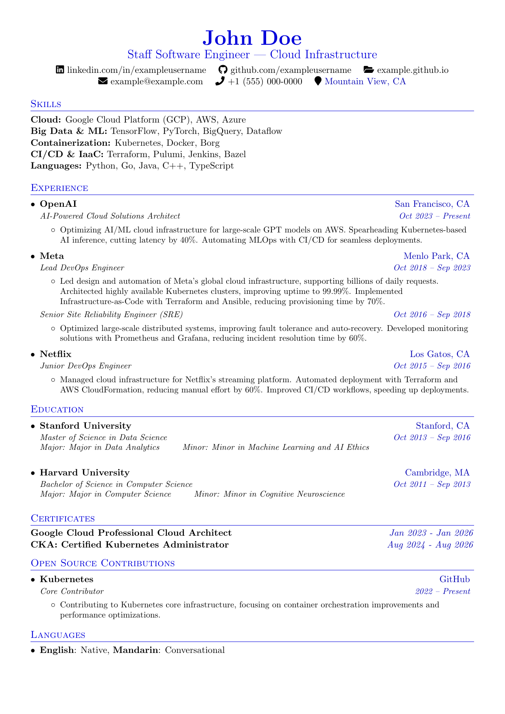
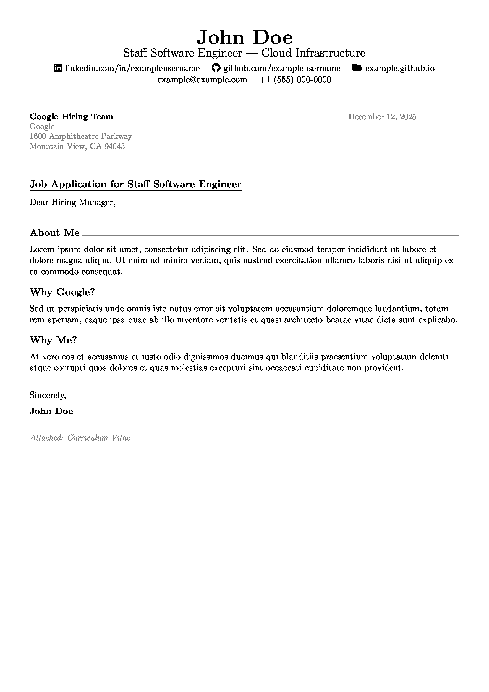
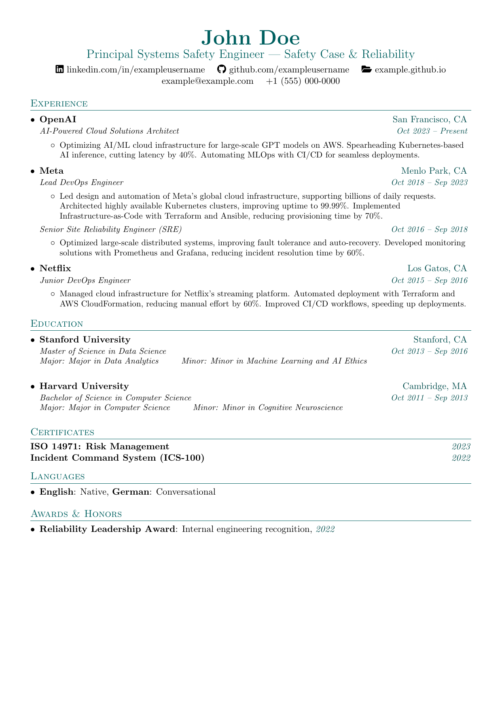
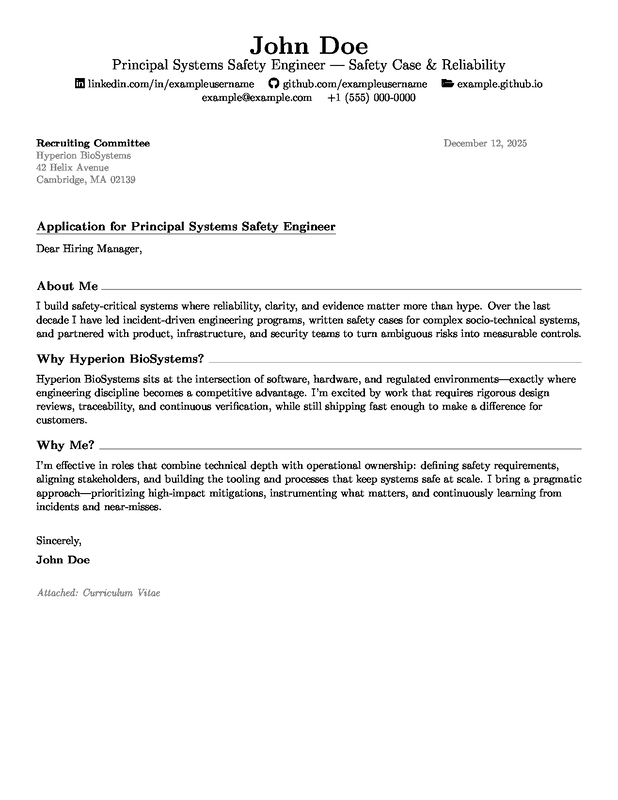
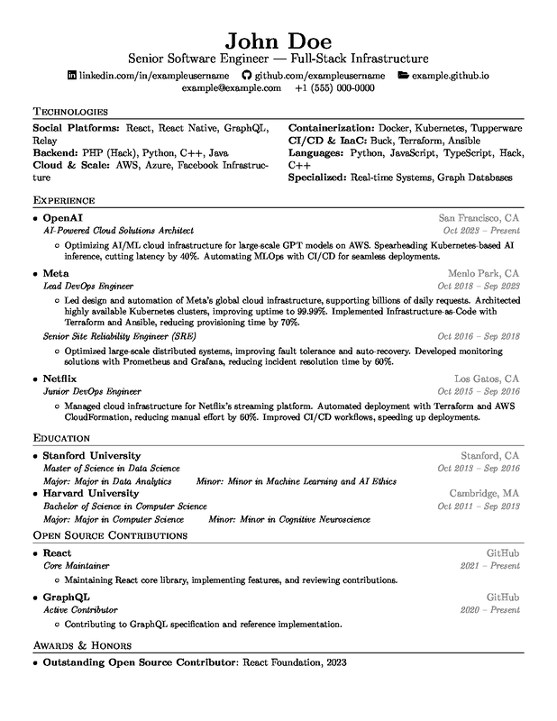
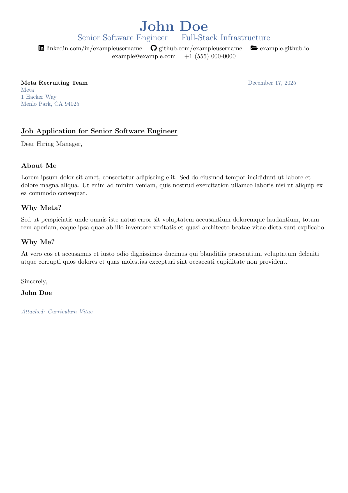
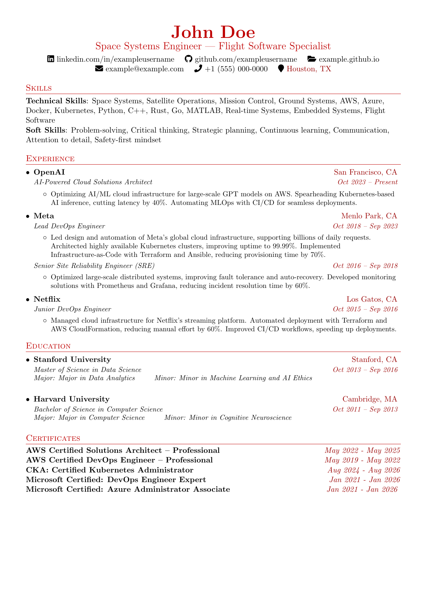
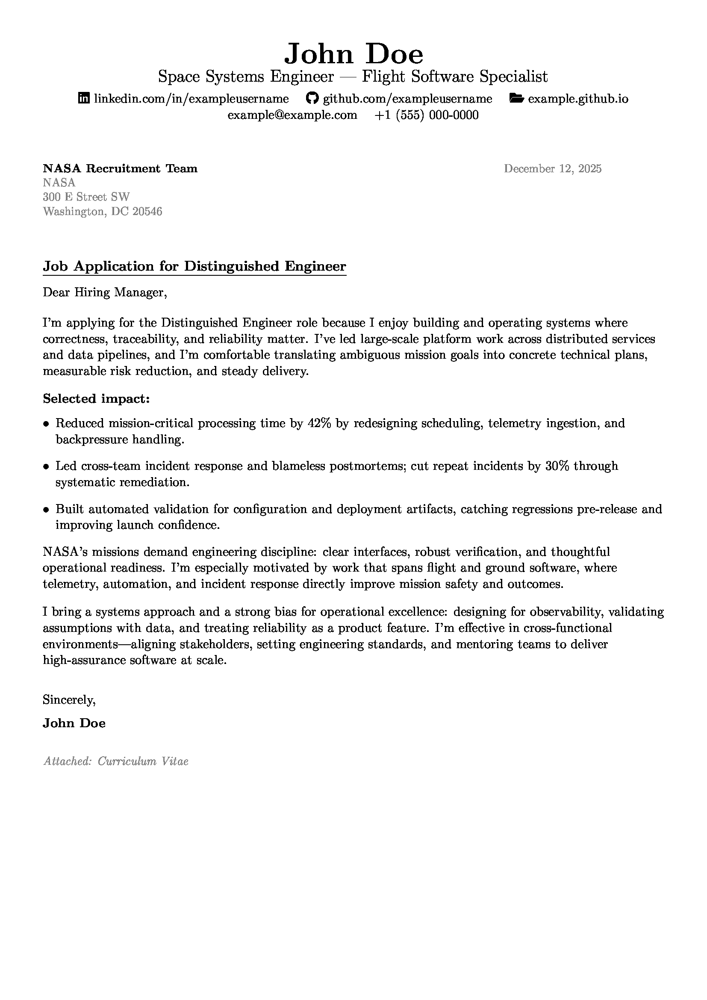

# Professional CV / Resume and Cover Letter LaTeX Templates

A clean, modern LaTeX template for a professional **CV** (also called a **resume/résumé**) and cover letter. ATS-friendly and easy to customize.

**Keywords**: CV, resume, résumé, curriculum vitae, cover letter

## Features

- Professional one-page CV layout
- Matching cover letter template
- **Company-specific customization** - Tailor CV and cover letter for each application
- **Shared code architecture** - Common packages and commands in `templates/common.sty`
- **Shared company variables** - Variables used by both CV and cover letter in `shared.tex`
- Centralized personal information
- Optional sections: Certificates, Open Source, Volunteer Work, Languages, Awards
- Optional certificate links (Credly badges)
- Multi-language date formatting (configurable via babel)
- Paper size is configurable (A4 by default)

## Examples

Each company folder generates customized PDFs with company-specific CV skills and cover letter content/styles.

### Google

<table>
  <tr>
    <td width="50%" valign="top">
      <p align="center">
        <strong>CV</strong><br>
        <a href="examples/companies/google_cv.pdf">
          
        </a><br>
        <a href="examples/companies/google_cv.pdf">View PDF</a>
      </p>
    </td>
    <td width="50%" valign="top">
      <p align="center">
        <strong>Cover Letter</strong><br>
        <a href="examples/companies/google_cover_letter.pdf">
          
        </a><br>
        <a href="examples/companies/google_cover_letter.pdf">View PDF</a>
      </p>
    </td>
  </tr>
</table>

### Hyperion BioSystems

<table>
  <tr>
    <td width="50%" valign="top">
      <p align="center">
        <strong>CV</strong><br>
        <a href="examples/companies/hyperion_cv.pdf">
          
        </a><br>
        <a href="examples/companies/hyperion_cv.pdf">View PDF</a>
      </p>
    </td>
    <td width="50%" valign="top">
      <p align="center">
        <strong>Cover Letter</strong><br>
        <a href="examples/companies/hyperion_cover_letter.pdf">
          
        </a><br>
        <a href="examples/companies/hyperion_cover_letter.pdf">View PDF</a>
      </p>
    </td>
  </tr>
</table>

### Meta

<table>
  <tr>
    <td width="50%" valign="top">
      <p align="center">
        <strong>CV</strong><br>
        <a href="examples/companies/meta_cv.pdf">
          
        </a><br>
        <a href="examples/companies/meta_cv.pdf">View PDF</a>
      </p>
    </td>
    <td width="50%" valign="top">
      <p align="center">
        <strong>Cover Letter</strong><br>
        <a href="examples/companies/meta_cover_letter.pdf">
          
        </a><br>
        <a href="examples/companies/meta_cover_letter.pdf">View PDF</a>
      </p>
    </td>
  </tr>
</table>

### NASA

<table>
  <tr>
    <td width="50%" valign="top">
      <p align="center">
        <strong>CV</strong><br>
        <a href="examples/companies/nasa_cv.pdf">
          
        </a><br>
        <a href="examples/companies/nasa_cv.pdf">View PDF</a>
      </p>
    </td>
    <td width="50%" valign="top">
      <p align="center">
        <strong>Cover Letter</strong><br>
        <a href="examples/companies/nasa_cover_letter.pdf">
          
        </a><br>
        <a href="examples/companies/nasa_cover_letter.pdf">View PDF</a>
      </p>
    </td>
  </tr>
</table>

## Quick Start

### 1. Edit Personal Information

Edit `personal_info.tex` with your name, contact info, and online presence.

### 2. Use Existing Example or Create New Company

Pick one of these workflows. In all cases, you run `pdflatex` to **compile a `.tex` file into a `.pdf`**.

- `pdflatex cv.tex` → creates `cv.pdf` (your CV)
- `pdflatex cover_letter.tex` → creates `cover_letter.pdf` (your cover letter)

**Option A: Use an existing example (Google, Hyperion, Meta, NASA)**

*Using Makefile (recommended):*
```bash
# Build all companies
make

# Build specific company
make google  # or hyperion, meta, nasa

# Build base templates
make templates
```

*Manual compilation:*
```bash
cd companies/nasa  # or google, hyperion, meta
# Edit shared.tex (cvtitle), cv.tex, and cover_letter.tex (company-specific fields)
# Also edit personal_info.tex (your personal details)
pdflatex cv.tex
pdflatex cover_letter.tex
```

**Option B: Create a new company folder (recommended: copy an existing one)**
```bash
cp -R companies/nasa companies/your_company  # or copy google/meta
cd companies/your_company
# Edit shared.tex (cvtitle), cv.tex, and cover_letter.tex (company-specific fields)
# Also edit personal_info.tex (your personal details)

# Build using Makefile (from project root)
make your_company

# Or build manually
pdflatex cv.tex
pdflatex cover_letter.tex
```

**Option C: Compile the base CV (generic)**
```bash
# Using Makefile
make templates

# Or manually
cd templates
pdflatex cv_template.tex  # Builds templates/cv_template.pdf using defaults from base_config.tex
```

**Output file naming:**

- **Using Makefile**: Automatically generates `{company}_cv.pdf` and `{company}_cover_letter.pdf`
  - Example: `make google` → `google_cv.pdf`, `google_cover_letter.pdf`
- **Manual compilation**: Defaults to `cv.pdf` and `cover_letter.pdf`
  - To use company-prefixed names manually, use `-jobname`:
  ```bash
  pdflatex -jobname="google_cv" cv.tex
  pdflatex -jobname="google_cover_letter" cover_letter.tex
  ```

## Project Structure

```
project/
├── personal_info.tex          # Shared personal info
├── document_settings.tex      # Global settings (paper size, font size)
├── templates/                 # Base templates and shared code
│   ├── cv_template.tex       # Base CV template
│   ├── cover_letter_template.tex # Base cover letter template
│   ├── base_config.tex       # Default values for all fields
│   └── common.sty            # Shared packages, commands, and helper macros
└── companies/                 # Company-specific folders
    ├── google/
    │   ├── shared.tex        # Shared variables (cvtitle, etc.)
    │   ├── cv.tex            # CV customizations
    │   └── cover_letter.tex  # Cover letter customizations
    ├── hyperion/
    │   ├── shared.tex
    │   ├── cv.tex
    │   └── cover_letter.tex
    ├── meta/
    │   └── ...
    └── nasa/
        └── ...
```

## Configuration

### Personal Information (`personal_info.tex`)

Edit once, used across all CVs and cover letters:
- Name, email, phone
- LinkedIn, GitHub, portfolio URLs

### Base Configuration (`templates/base_config.tex`)

Contains default values for all fields:
- CV: title, technologies, certificates (4), open source (empty), volunteer (empty), languages (empty), awards (empty)
- Cover letter: company details, letter content, date settings

### Company Files

Each company folder contains three files:

**1. `shared.tex` - Shared variables (used by both CV and cover letter)**
```latex
% Professional title (used in headers of both CV and cover letter)
\renewcommand{\cvtitle}{Space Systems Engineer | Flight Software Specialist}
```

**2. `cv.tex` - CV-specific customizations**
```latex
% Load shared company configuration (variables used by both CV and cover letter)
\loadfile{shared.tex}{}

% CV customizations
\renewcommand{\cvtechnologies}{%
  \section{Skills}
  \cvSubHeadingListStart
    \item{\textbf{Technical Skills}{:} Space Systems, Satellite Operations...}
  \cvSubHeadingListEnd
}

% Certificates with optional links
\renewcommand{\cvcertificates}{%
  \href{https://www.credly.com/badges/YOUR_BADGE_ID}{\textbf{Certificate Name}} & \textcolor{gray}{\textit{Date}} \\
  \textbf{Certificate Without Link} & \textcolor{gray}{\textit{Date}} \\
}

% Optional sections (leave empty to hide)
\renewcommand{\cvopensource}{...}      % Open Source Contributions
\renewcommand{\cvvolunteer}{...}       % Volunteer Work
\renewcommand{\cvlanguages}{...}      % Languages
\renewcommand{\cvawards}{...}         % Awards & Honors
```

**3. `cover_letter.tex` - Cover letter-specific customizations**
```latex
% Load shared company configuration (variables used by both CV and cover letter)
\loadfile{shared.tex}{}

% Company details
\renewcommand{\companyname}{NASA}
\renewcommand{\companyaddress}{300 E Street SW}
\renewcommand{\companyrecipient}{NASA Hiring Team}
\renewcommand{\companycity}{Washington, DC 20546}

% Letter settings
\renewcommand{\letterdatelanguage}{english}  % or "finnish" (must match babel languages)
\renewcommand{\letterdate}{auto}             % or specific date like "January 15, 2024"
\renewcommand{\lettertitle}{Application for Space Systems Engineer Position}
\renewcommand{\letteropening}{Dear NASA Hiring Team,}
\renewcommand{\letterclosing}{Sincerely,}

% Letter body
\renewcommand{\letterbody}{%
  Your letter content here...
}
```

**Key points:**
- Use `\renewcommand` (not `\newcommand`) to override base defaults
- `shared.tex` contains variables used by both CV and cover letter (like `\cvtitle`)
- Only define fields that differ from base - undefined fields use base defaults
- Optional sections are hidden if empty
- Date language must match a language loaded in babel (e.g., `[finnish,english]`)

## CV Sections

**Required:**
- Header (name, title, contact)
- Experience
- Education

**Optional (configurable in `cv.tex`):**
- Technologies/Skills (set `\renewcommand{\cvtechnologies}{}` to hide)
- Certificates (with optional clickable links)
- Open Source Contributions
- Volunteer Work
- Languages
- Awards & Honors

## Cover Letter Sections

- Header (same as CV)
- Company details and date
- Letter title and opening
- Letter body (**company-specific**)
- Closing

**Cover letter body styles (examples in this repo):**
- **Headed sections + horizontal rule**: Google
- **Headed sections (no horizontal rule)**: Meta
- **Plain paragraphs (no section headlines)**: Hyperion
- **Impact bullets (paragraph + 2–3 bullets + paragraphs)**: NASA

**How to customize the body:**
- **Content and layout**: override `\letterbody` directly in `companies/*/cover_letter.tex` - define your letter content inline (no intermediate variables needed)
- **Optional style helpers**: override `\lettersection` in `companies/*/cover_letter.tex` if you want to customize section heading appearance

## Requirements

- LaTeX distribution (TeX Live, MiKTeX, or MacTeX)
- Packages: `xcolor`, `hyperref`, `fontawesome5`, `babel`, `tabularx`, `titlesec`, `fancyhdr`, `enumitem`, `etoolbox`
- Make (optional, for automated builds)
- chktex (optional, for advanced linting - install via `brew install chktex` on macOS or `sudo apt-get install chktex` on Linux)

Most packages are included in standard LaTeX distributions.

## Building

### Using Makefile (Recommended)

A `Makefile` is provided for easy building:

```bash
# Build all company CVs and cover letters
make

# Build specific company
make google      # Builds Google CV and cover letter
make hyperion    # Builds Hyperion CV and cover letter
make meta        # Builds Meta CV and cover letter
make nasa        # Builds NASA CV and cover letter

# Build base templates
make templates

# Validate all templates compile successfully
make validate

# Lint LaTeX files for common errors
make lint

# Clean build artifacts (keeps PDFs)
make clean

# Clean everything including PDFs (keeps examples)
make clean-all

# Show help
make help
```

### Manual Building

You can also compile manually using `pdflatex`:

```bash
cd companies/google
pdflatex cv.tex
pdflatex cover_letter.tex
```

Note: LaTeX typically requires two passes to resolve cross-references and generate correct page numbers.

## Validation and Linting

The project includes validation and linting scripts to help catch errors before building:

### Validation (`scripts/validate.sh`)

Validates that all company CVs and cover letters compile successfully:

```bash
# Using Makefile
make validate

# Or directly
./scripts/validate.sh
```

This script:
- Compiles all template files
- Compiles all company-specific CVs and cover letters
- Reports which files passed or failed
- Shows error logs for failed compilations

### Linting (`scripts/lint.sh`)

Checks LaTeX files for common errors and issues:

```bash
# Using Makefile
make lint

# Or directly
./scripts/lint.sh
```

This script checks for:
- Mismatched braces
- Undefined command references
- Common LaTeX typos
- Missing required file loads
- Hardcoded paths (should use `\loadfile`)

If `chktex` is installed, it also runs advanced linting checks.

## Architecture

The template uses a modular architecture that separates shared code, defaults, and company-specific customizations. This design reduces code duplication and makes maintenance easier.

### File Structure and Loading Order

When compiling a company CV or cover letter, files are loaded in the following order:

1. **`document_settings.tex`** (root) - Global settings (paper size, font size)
2. **`templates/common.sty`** - Shared packages, custom commands, and helper macros
3. **Company-specific packages** (e.g., `babel`, `glyphtounicode`) - Loaded in `cv.tex` or `cover_letter.tex`
4. **`personal_info.tex`** (root) - Personal information (name, email, etc.)
5. **`templates/base_config.tex`** - Default values for all fields
6. **`companies/*/shared.tex`** - Company-specific shared variables (e.g., `\cvtitle`)
7. **`companies/*/cv.tex` or `cover_letter.tex`** - Company-specific customizations (overrides defaults)

### File Path Resolution (`\loadfile`)

The `\loadfile` helper macro provides flexible file path resolution, allowing templates to be compiled from different directories:

```latex
\newcommand{\loadfile}[2]{%
  \IfFileExists{../../#1}{\input{../../#1}}{%
  \IfFileExists{../#1}{\input{../#1}}{%
  \IfFileExists{#1}{\input{#1}}{#2}}}%
}
```

**How it works:**
- Checks paths in order: `../../file.tex` → `../file.tex` → `file.tex`
- Falls back to optional second argument if file not found
- Allows compilation from root, `templates/`, or `companies/<name>/` directories

**Example usage:**
```latex
\loadfile{personal_info.tex}{}  % Loads from root, regardless of compilation directory
\loadfile{templates/common.sty}{}  % Loads common package
```

### Variable Override Chain

Variables follow a hierarchy where later definitions override earlier ones:

```
base_config.tex (defaults)
    ↓
shared.tex (company-specific shared variables)
    ↓
cv.tex / cover_letter.tex (company-specific customizations)
```

**Example:**
- `base_config.tex` defines: `\newcommand{\cvtitle}{Cloud Evangelist | AI Whisperer}`
- `companies/nasa/shared.tex` overrides: `\renewcommand{\cvtitle}{Space Systems Engineer}`
- `companies/nasa/cv.tex` can further override if needed

**Key principle:** Use `\renewcommand` (not `\newcommand`) in company files to override base defaults.

### Modular Components

#### `templates/common.sty`
Central package containing:
- **Shared LaTeX packages**: `hyperref`, `xcolor`, `fontawesome5`, `tabularx`, etc.
- **Page setup**: Margins, headers, footers, section formatting
- **Helper macros**:
  - `\loadfile{file}{fallback}` - Flexible file path resolution
  - `\ifnotempty{cmd}{if-not-empty}{if-empty}` - Conditional content execution
  - `\conditionalsection{cmd}{content}` - Conditional section visibility
  - `\setupcoverletterdate` - Date language and auto-date handling
- **Custom CV commands**: `\cvItem`, `\cvSubheading`, `\cvProjectItem`, etc.
- **Cover letter commands**: `\lettersection`

#### `templates/base_config.tex`
Default values for all CV and cover letter fields:
- CV: `\cvtitle`, `\cvtechnologies`, `\cvcertificates`, optional sections
- Cover letter: `\letterdate`, `\letterdatelanguage`, `\letterbody`, company details

#### `companies/*/shared.tex`
Company-specific variables used by both CV and cover letter:
- `\cvtitle` - Professional title/tagline
- Any other shared variables

#### `companies/*/cv.tex` and `cover_letter.tex`
Company-specific customizations:
- Override defaults from `base_config.tex`
- Define company-specific content (technologies, letter body, etc.)
- Load `shared.tex` for shared variables

### Compilation Flow

```
Company CV/Cover Letter Compilation:
┌─────────────────────────────────────┐
│ 1. Load document_settings.tex       │ (paper size, global settings)
│ 2. Load templates/common.sty         │ (packages, commands, helpers)
│ 3. Load company-specific packages    │ (babel, glyphtounicode)
│ 4. Load personal_info.tex            │ (name, email, contact)
│ 5. Load templates/base_config.tex    │ (default field values)
│ 6. Load companies/*/shared.tex       │ (company shared variables)
│ 7. Load companies/*/cv.tex          │ (company customizations)
│ 8. Render document                   │ (combine all loaded content)
└─────────────────────────────────────┘
```

### Design Principles

1. **DRY (Don't Repeat Yourself)**: Shared code lives in `common.sty`, not duplicated
2. **Separation of Concerns**: Personal info, defaults, and customizations are separate
3. **Flexibility**: Company files only override what's needed, inherit the rest
4. **Maintainability**: Changes to shared code propagate to all templates
5. **Portability**: `\loadfile` allows compilation from any directory

### Benefits

- **Reduced duplication**: ~200 lines of shared code centralized in `common.sty`
- **Easier maintenance**: Update packages/commands in one place
- **Consistent styling**: All CVs and cover letters use the same base styles
- **Flexible customization**: Companies can override any default
- **Clear structure**: Easy to understand what goes where

## Paper size (A4 vs Letter)

Paper size is configured globally in `document_settings.tex`.

- **Default**: `\papersize` = `a4paper`
- **US/Canada**: set `\papersize` = `letterpaper`

## Customization

- **Colors**: Modify `\textcolor{gray}{}` in templates
- **Sections**: Add, remove, or reorder in template files
- **Layout**: Adjust margins/spacing in template preamble
- **Company-specific**: Customize per company in `cv.tex` and `cover_letter.tex`

## License

MIT License - see [LICENSE](LICENSE) file for details.

## Credits

- Original template by [Sourabh Bajaj](https://github.com/sb2nov/resume)
- Adapted and enhanced with cover letter template
